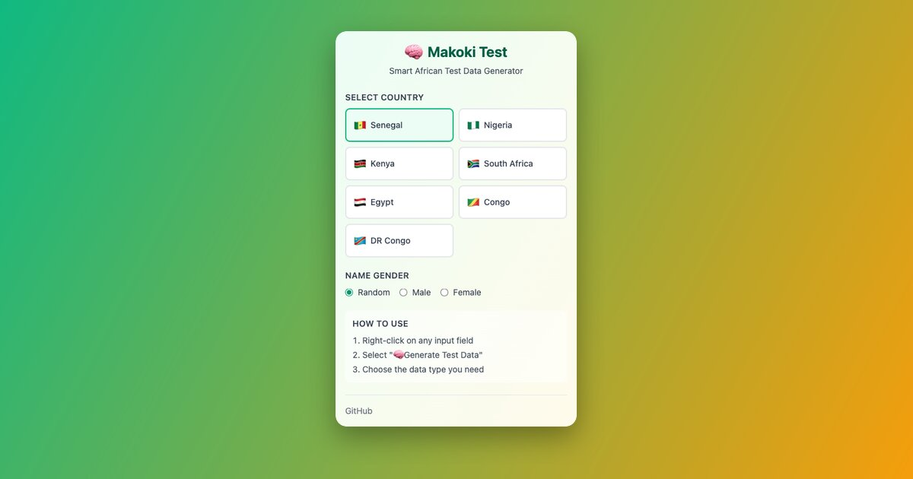
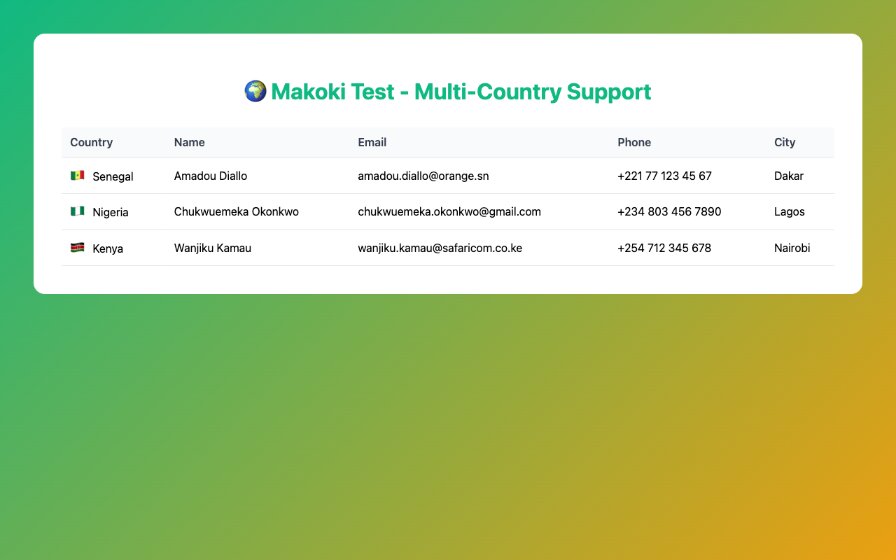
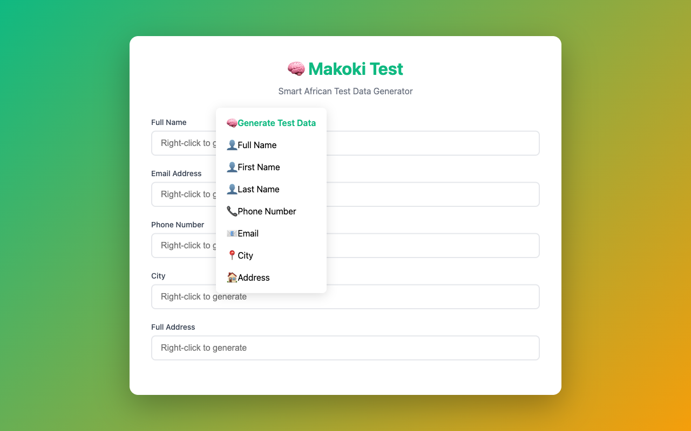
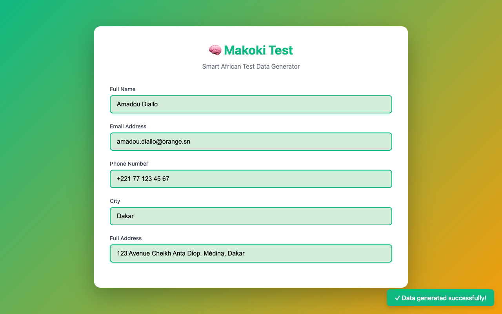

## Introduction : Le problème des données de test occidentales

En tant que développeur africain, j'ai toujours été frustré par les données de test génériques. "John Doe", "123 Main Street", "New York" - ces données ne reflètent pas la réalité des applications que je développe pour des clients africains. Combien de fois ai-je dû inventer des noms sénégalais, des adresses de Dakar, ou des numéros de téléphone avec le bon format (+221) ?

Cette frustration quotidienne a donné naissance à **Makoki Test**, une extension Chrome qui génère des données de test africaines authentiques en un simple clic droit.

## La genèse de l'idée : Pourquoi "Makoki" ?

"Makoki" signifie "intelligence" ou "capacité" en Lingala, une langue parlée en République Démocratique du Congo et en République du Congo. Ce nom reflète parfaitement la mission de l'extension : fournir des données de test intelligentes et contextuelles pour les développeurs africains.

L'idée est née d'un constat simple : les outils de génération de données existants (comme Faker.js) sont excellents pour les contextes occidentaux, mais ne répondent pas aux besoins spécifiques des développeurs africains. Nous avons besoin de :

- **Noms authentiques** : Amadou Diallo, Chukwuemeka Okonkwo, Wanjiku Kamau
- **Villes réelles** : Dakar, Lagos, Nairobi, Johannesburg
- **Formats de téléphone corrects** : +221 77 123 45 67 (Sénégal), +234 803 456 7890 (Nigeria)
- **Adresses réalistes** : Avenue Cheikh Anta Diop, Awolowo Road, Kenyatta Avenue

## Le développement : Un parcours technique

### Choix technologiques

Pour construire Makoki Test, j'ai opté pour une stack moderne et performante :

- **Vue.js 3** avec Composition API : Pour l'interface popup, moderne et réactive
- **TypeScript** : Pour la sécurité de types et une meilleure maintenabilité
- **Chrome Extension Manifest V3** : La dernière version du standard Chrome
- **Vite** : Pour un build rapide et optimisé
- **Tailwind CSS** : Pour un design moderne et cohérent

### Les défis techniques

#### 1. Intégration des données GADM

L'un des défis majeurs a été l'intégration des données géographiques. J'ai utilisé la base de données **GADM** (Global Administrative Areas) pour obtenir des données spatiales précises sur les régions, villes et divisions administratives de 7 pays africains.

```typescript
// Exemple de structure de données
{
  "regions": [
    { "code": "DK", "name": "Dakar" },
    { "code": "TH", "name": "Thiès" }
  ],
  "cities": ["Dakar", "Pikine", "Touba", "Thiès"],
  "streetPatterns": [
    "{number} Avenue {name}",
    "{number} Rue {name}",
    "Boulevard {name}"
  ]
}
```

#### 2. Pourquoi ne pas utiliser Faker.js ?

Au début, j'ai considéré utiliser Faker.js, mais j'ai rapidement réalisé que cela irait à l'encontre de l'objectif même de Makoki Test. Faker.js génère des données aléatoires qui peuvent sembler réalistes, mais ne sont pas authentiquement africaines.

**Makoki Test utilise uniquement des données curatées** :
- Noms collectés et validés par des locuteurs natifs
- Villes et régions issues de données officielles (GADM)
- Formats de téléphone conformes aux standards ITU-T E.164
- Adresses basées sur des patterns réels observés

#### 3. Génération de données sans dépendances externes

Tout fonctionne **100% localement** :
- Aucun appel API externe
- Aucune dépendance runtime (comme Faker.js)
- Fonctionnement hors ligne garanti
- Respect total de la vie privée

### Architecture de l'extension

L'extension suit une architecture modulaire :

```
makoki/
├── src/
│   ├── background/     # Service worker (menu contextuel)
│   ├── content/        # Scripts d'injection (remplissage de formulaires)
│   ├── popup/          # Interface Vue.js
│   ├── generators/     # Logique de génération de données
│   └── data/           # Données par pays (JSON)
```

Chaque générateur est indépendant et testable :

- `name-generator.ts` : Génération de noms par pays et genre
- `phone-generator.ts` : Formats de téléphone par pays
- `address-generator.ts` : Adresses complètes avec villes et régions
- `email-generator.ts` : Emails avec domaines locaux

## Les données africaines authentiques

### Curation méticuleuse

Chaque pays supporté a ses propres fichiers de données :

- **`names.json`** : Prénoms et noms de famille authentiques
- **`locations.json`** : Villes, régions, et patterns de rues
- **`formats.json`** : Formats de téléphone et d'adresse

Actuellement, **7 pays sont supportés** :
- 🇸🇳 Sénégal
- 🇳🇬 Nigeria
- 🇰🇪 Kenya
- 🇿🇦 Afrique du Sud
- 🇪🇬 Égypte
- 🇨🇬 République du Congo
- 🇨🇩 République Démocratique du Congo



### Exemples de données générées

**Sénégal** :
- Nom : Amadou Diallo
- Téléphone : +221 77 123 45 67
- Adresse : 123 Avenue Cheikh Anta Diop, Médina, Dakar

**Nigeria** :
- Nom : Chukwuemeka Okonkwo
- Téléphone : +234 803 456 7890
- Adresse : 45 Awolowo Road, Victoria Island, Lagos

**Kenya** :
- Nom : Wanjiku Kamau
- Téléphone : +254 712 345 678
- Adresse : 78 Kenyatta Avenue, Westlands, Nairobi

## De l'idée à la production

### Tests et qualité

L'extension compte **62 tests unitaires** qui couvrent tous les générateurs :

```typescript
describe('Name Generator', () => {
  it('should generate valid Senegalese name', () => {
    const name = generateName({ country: 'SN', gender: 'male' })
    expect(name).toBeTruthy()
    expect(typeof name).toBe('string')
  })
})
```

Tous les tests passent, garantissant la fiabilité de la génération de données.

### Préparation pour Chrome Web Store

La soumission sur Chrome Web Store nécessite une préparation minutieuse :

1. **Assets visuels** : Screenshots, icônes, images promotionnelles
2. **Documentation** : Descriptions, justifications de permissions
3. **Tests manuels** : Vérification sur différents sites web
4. **Build optimisé** : Package de 81.72 KB, prêt pour la distribution

J'ai même créé un script automatisé pour générer les screenshots :

```bash
pnpm screenshots  # Génère 5 screenshots (1280x800)
pnpm promo-images # Génère les images promotionnelles
```



## En route vers le Chrome Web Store

Après des semaines de développement, de tests et de préparation, j'ai finalement soumis **Makoki Test sur le Chrome Web Store**. L'extension est actuellement **en cours de validation** par l'équipe de Google.

### Le processus de soumission

La soumission sur Chrome Web Store n'est pas une simple formalité. Il faut :

- Préparer tous les assets (screenshots, descriptions, icônes)
- Justifier chaque permission demandée
- Expliquer l'objectif unique de l'extension
- Fournir des garanties de confidentialité

Pour Makoki Test, j'ai dû justifier l'utilisation de `<all_urls>` - une permission qui permet à l'extension de fonctionner sur n'importe quel site web. C'est nécessaire car les développeurs utilisent cette extension sur une variété infinie de sites (localhost, staging, production, applications internes). Chrome Web Store examine attentivement ce type de permission, ce qui est une bonne pratique de sécurité.

### En attente de publication

L'extension est maintenant dans la file d'attente de review. Le processus peut prendre quelques jours, mais une fois approuvée, **Makoki Test sera disponible pour tous les développeurs sur le Chrome Web Store**.

En attendant, le code source est déjà disponible sur [GitHub](https://github.com/nangui/makoki) et l'extension peut être installée manuellement pour les développeurs qui souhaitent l'essayer dès maintenant.



## L'avenir de Makoki Test

### Roadmap technique

Makoki Test ne se limite pas à une simple extension Chrome. La vision est plus large :

1. **Firefox Support** : Port de l'extension vers Firefox
2. **API REST** : Endpoint public pour générer des données programmatiquement
3. **VS Code Extension** : Intégration dans l'éditeur de code
4. **npm Package** : Package Node.js pour les tests automatisés
5. **Plus de pays** : Objectif de 20+ pays africains

### Vision au-delà de l'extension

L'objectif est de créer un **écosystème d'outils** pour les développeurs africains :
- Bibliothèques de données open source
- Outils de test intégrés
- Communauté de contributeurs
- Standards pour les données de test africaines

## Appel à contribution : Ouvrir les portes

Makoki Test est un projet **open source** (licence MIT) et j'aimerais ouvrir les portes à tous ceux qui souhaitent contribuer, qu'ils soient développeurs juniors ou designers expérimentés.

### Pour les développeurs juniors

C'est le **projet parfait pour commencer** dans l'open source :

#### Issues "Good First Issue"

- **Ajouter un nouveau pays** : Structure simple, données à curater
- **Améliorer les générateurs** : Ajouter de nouveaux patterns
- **Documentation** : Améliorer le README, ajouter des exemples
- **Tests** : Augmenter la couverture de tests

#### Comment contribuer ?

1. Fork le repository sur GitHub
2. Créer une branche pour ta contribution
3. Ajouter les données d'un nouveau pays (ou améliorer l'existant)
4. Soumettre une Pull Request

**Exemple : Ajouter le Ghana**

```typescript
// src/data/countries/GH/names.json
{
  "firstNames": {
    "male": ["Kwame", "Kofi", "Akwasi"],
    "female": ["Ama", "Akosua", "Adwoa"],
    "neutral": []
  },
  "lastNames": ["Mensah", "Asante", "Osei"]
}
```

C'est simple, structuré, et tu apprendras beaucoup sur :
- TypeScript
- Chrome Extensions
- Gestion de données JSON
- Tests unitaires
- Git et GitHub

### Pour les designers

Makoki Test a besoin de **talents créatifs** :

#### 1. Création de logo

Le logo actuel est un emoji 🧠. Nous avons besoin d'un **vrai logo** qui :
- Représente l'intelligence ("Makoki")
- Intègre des motifs africains
- Est moderne et tech-friendly
- Fonctionne en différentes tailles (16px à 512px)

#### 2. Design d'icônes

Les icônes actuelles sont basiques. Nous cherchons :
- Icônes pour l'extension (16, 24, 32, 48, 128px)
- Variations pour différents contextes
- Style cohérent avec l'identité de marque

#### 3. Amélioration de l'UI/UX

L'interface popup peut être améliorée :
- Meilleure hiérarchie visuelle
- Animations subtiles
- Responsive design
- Accessibilité (WCAG 2.1 AA)

#### 4. Assets marketing

- Bannières pour GitHub
- Images pour les réseaux sociaux
- Présentations visuelles
- Brand guidelines

### Comment contribuer en design ?

1. Créer des propositions de design
2. Les partager dans une issue GitHub
3. Collaborer avec la communauté
4. Voir tes créations utilisées par des milliers de développeurs

## Impact et vision

### Pourquoi c'est important

Makoki Test répond à un besoin réel : **représenter l'Afrique dans les outils de développement**. Trop souvent, les outils que nous utilisons sont conçus pour des contextes occidentaux. Makoki Test change cela.

### Message aux développeurs africains

Si tu es développeur africain et que tu utilises des données de test génériques, **Makoki Test est fait pour toi**. C'est un outil créé par un développeur africain, pour les développeurs africains.

### Rejoindre la communauté

- **GitHub** : [github.com/nangui/makoki](https://github.com/nangui/makoki)
- **Issues** : Propose des idées, signale des bugs
- **Discussions** : Partage tes retours et expériences
- **Contributions** : Ajoute ton pays, améliore le code

## Conclusion

Créer Makoki Test a été un voyage incroyable. De l'idée initiale à la soumission sur Chrome Web Store, chaque étape a été une opportunité d'apprendre et de créer quelque chose d'utile pour la communauté.

L'extension est maintenant **en cours de validation** et sera bientôt disponible pour tous. Mais le projet ne s'arrête pas là. Avec l'aide de la communauté - développeurs juniors, designers, et contributeurs de tous horizons - Makoki Test peut devenir l'outil de référence pour les données de test africaines.

**Rejoignez-nous** sur GitHub et contribuez à faire de Makoki Test un projet qui représente vraiment l'Afrique dans l'écosystème des outils de développement.

---

*Makoki Test - "Makoki" signifie intelligence/capacité en Lingala 🧠*

*Fait avec ❤️ pour les développeurs africains, par les développeurs africains.*
