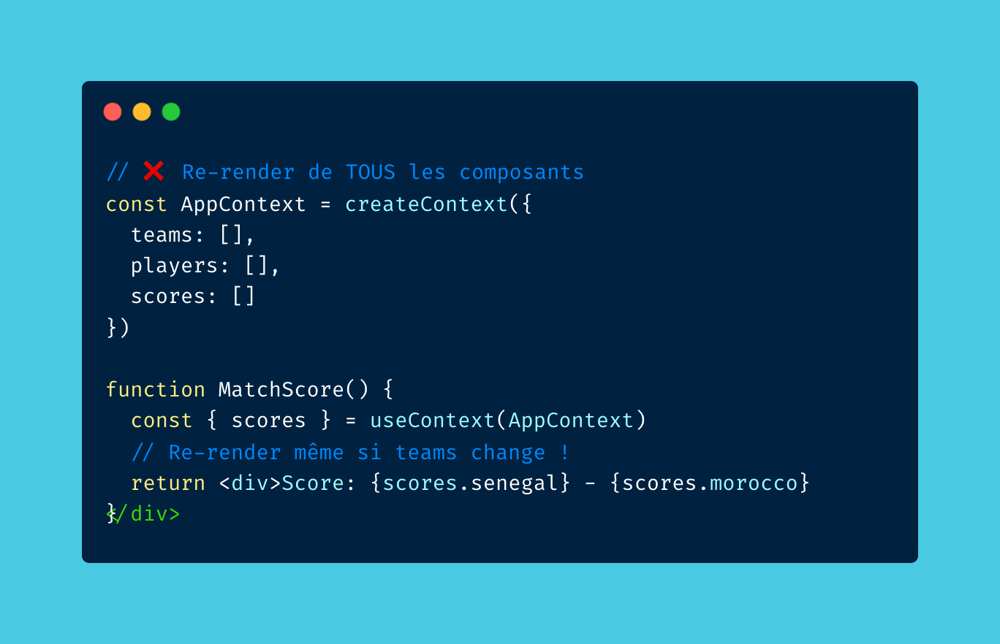
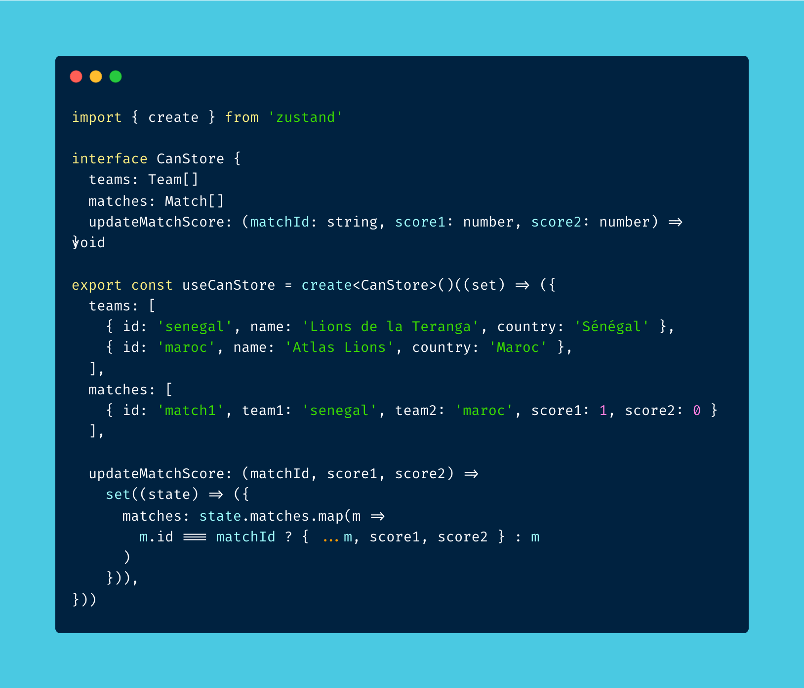
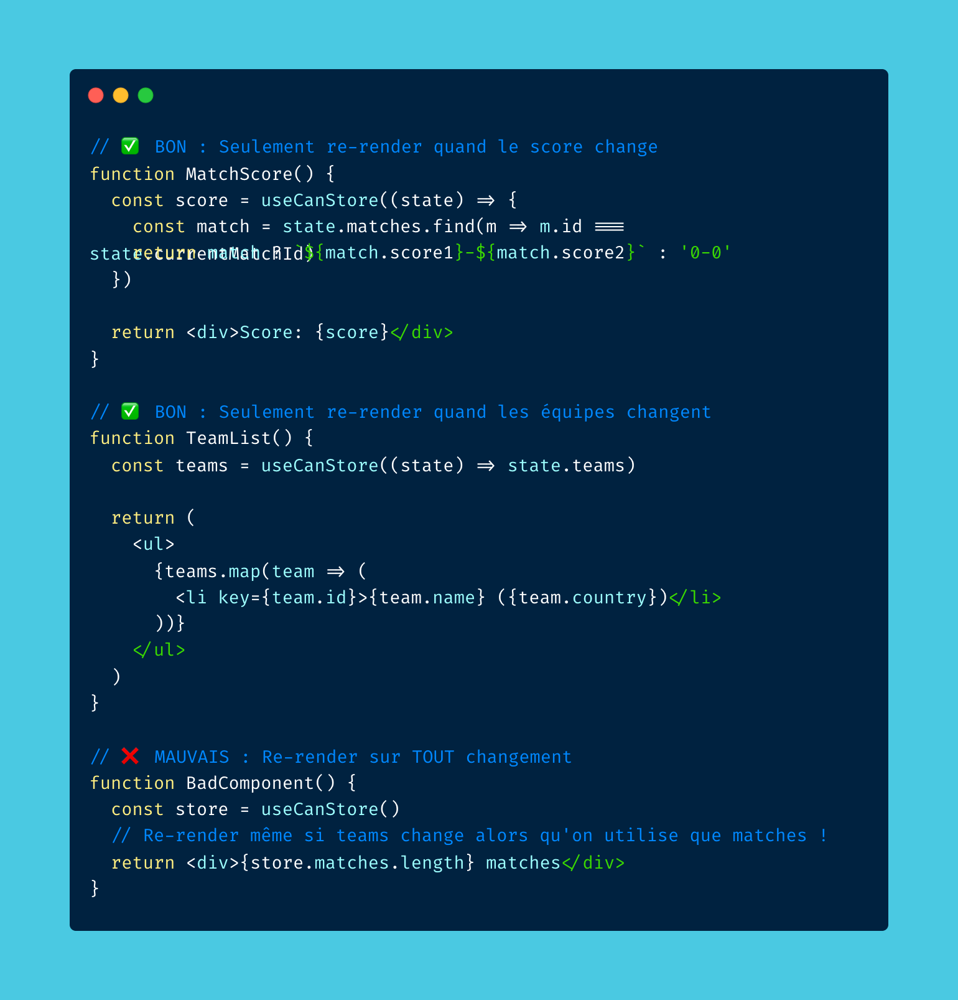
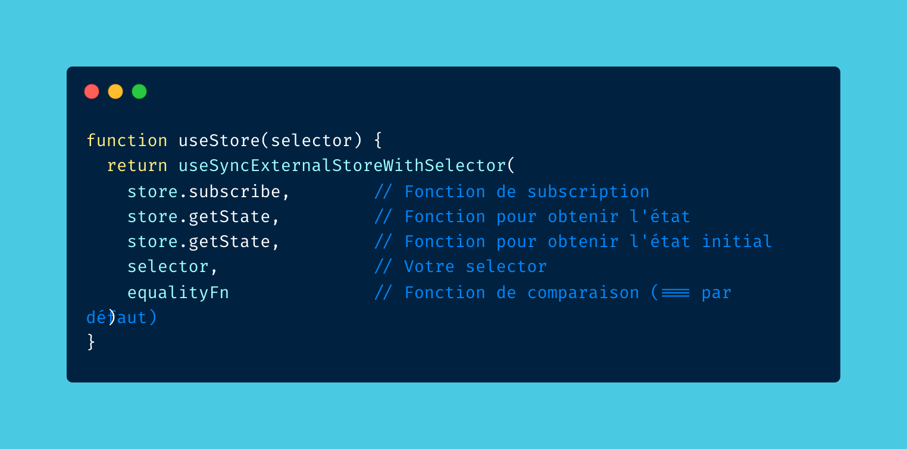
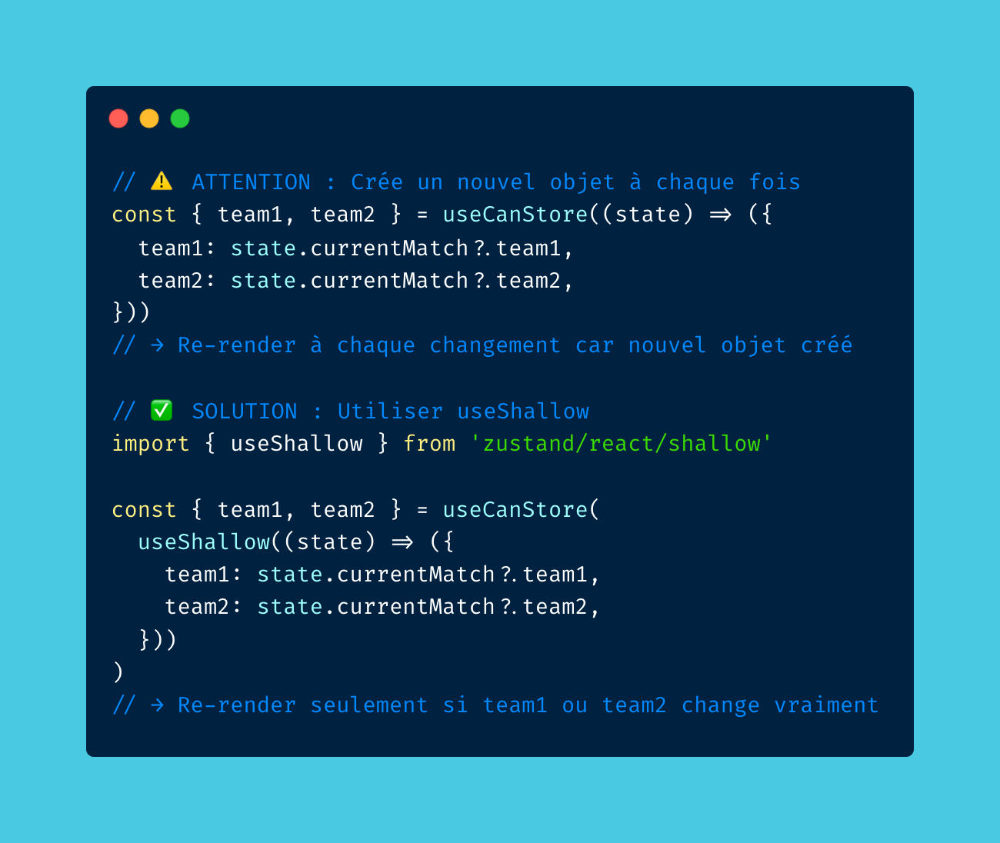

## Introduction : Le problème avec Context API

Vous utilisez encore Context API pour gérer l'état global dans React ? 

Voici pourquoi Zustand change la donne en termes de performance. ⚡

Avec `useContext`, **TOUS** les composants qui consomment ce contexte se re-rendent à chaque changement d'état, même si seule une petite partie a changé.



### Le problème en détail

Imaginons un contexte qui gère à la fois l'authentification, les préférences utilisateur et les notifications. Si vous mettez à jour uniquement les notifications, tous les composants qui utilisent ce contexte (même ceux qui n'utilisent que l'authentification) vont se re-rendre inutilement.

```typescript
// ❌ PROBLÈME : Tous les composants se re-rendent
const AppContext = createContext({
  user: null,
  notifications: [],
  preferences: {}
});

// Même si seul 'notifications' change, 
// tous les composants utilisant ce contexte se re-rendent
```

## Comment Zustand résout ce problème

Zustand utilise `useSyncExternalStoreWithSelector` (React 18+) qui permet de s'abonner **uniquement** à la partie de l'état qui vous intéresse.

### Architecture externe

Contrairement à Context API, les stores Zustand sont **externes** à l'arbre React. Les composants s'abonnent directement au store via des hooks, ce qui évite le problème "all-or-nothing" du Context.

## Exemple concret : Gestion de la CAN (Coupe d'Afrique)

Imaginons un store pour gérer la Coupe d'Afrique avec les équipes (Sénégal 🇸🇳, Maroc 🇲🇦), les joueurs et les scores.



```typescript
import { create } from 'zustand';

interface Team {
  id: string;
  name: string;
  flag: string;
  players: string[];
}

interface Match {
  id: string;
  team1: string;
  team2: string;
  score1: number;
  score2: number;
}

interface CANStore {
  teams: Team[];
  matches: Match[];
  selectedTeam: string | null;
  setSelectedTeam: (teamId: string | null) => void;
  updateScore: (matchId: string, score1: number, score2: number) => void;
  addTeam: (team: Team) => void;
}

const useCANStore = create<CANStore>((set) => ({
  teams: [
    { id: 'sn', name: 'Sénégal', flag: '🇸🇳', players: ['Sadio Mané', 'Kalidou Koulibaly'] },
    { id: 'ma', name: 'Maroc', flag: '🇲🇦', players: ['Achraf Hakimi', 'Yassine Bounou'] }
  ],
  matches: [],
  selectedTeam: null,
  setSelectedTeam: (teamId) => set({ selectedTeam: teamId }),
  updateScore: (matchId, score1, score2) => 
    set((state) => ({
      matches: state.matches.map(m => 
        m.id === matchId ? { ...m, score1, score2 } : m
      )
    })),
  addTeam: (team) => 
    set((state) => ({ teams: [...state.teams, team] }))
}));
```

## Utilisation optimale avec selectors



### ✅ BON : Utilisation avec selector

```typescript
// ✅ Seul ce composant se re-render si 'selectedTeam' change
function TeamSelector() {
  const selectedTeam = useCANStore((state) => state.selectedTeam);
  return <div>Équipe sélectionnée : {selectedTeam}</div>;
}

// ✅ Seul ce composant se re-render si 'teams' change
function TeamsList() {
  const teams = useCANStore((state) => state.teams);
  return (
    <ul>
      {teams.map(team => (
        <li key={team.id}>{team.flag} {team.name}</li>
      ))}
    </ul>
  );
}

// ✅ Seul ce composant se re-render si 'matches' change
function MatchesList() {
  const matches = useCANStore((state) => state.matches);
  return (
    <ul>
      {matches.map(match => (
        <li>{match.team1} {match.score1} - {match.score2} {match.team2}</li>
      ))}
    </ul>
  );
}
```

### ❌ MAUVAIS : Utilisation sans selector

```typescript
// ❌ Ce composant se re-render pour TOUS les changements du store
function TeamSelector() {
  const store = useCANStore(); // Pas de selector !
  return <div>Équipe : {store.selectedTeam}</div>;
}
```

## Comment ça fonctionne en interne ?

### 1️⃣ Subscription sélective

Zustand utilise `useSyncExternalStoreWithSelector` qui permet de s'abonner **uniquement** à la valeur retournée par votre selector.



```typescript
// Code interne simplifié de Zustand
function useStore<T, U>(
  store: StoreApi<T>,
  selector: (state: T) => U
) {
  return useSyncExternalStoreWithSelector(
    store.subscribe,           // Fonction de subscription
    store.getState,             // Fonction pour obtenir l'état
    store.getServerState,       // Pour SSR
    selector,                   // Selector pour filtrer l'état
    equalityFn                  // Fonction de comparaison (=== par défaut)
  );
}
```

**Comment ça marche ?**

1. Le composant s'abonne au store avec un selector
2. Quand l'état change, Zustand compare la **nouvelle valeur** du selector avec l'**ancienne valeur**
3. Si elles sont identiques (avec `===`), **pas de re-render**
4. Si elles sont différentes, **re-render uniquement ce composant**

### 2️⃣ Égalité référentielle

Par défaut, Zustand compare avec `===`. Si votre selector retourne une nouvelle référence à chaque fois, il y aura re-render.



```typescript
// ❌ PROBLÈME : Retourne un nouvel objet à chaque fois
const teams = useCANStore((state) => ({
  count: state.teams.length,
  names: state.teams.map(t => t.name)
})); // Nouvelle référence à chaque render !

// ✅ SOLUTION 1 : Selector simple
const teamCount = useCANStore((state) => state.teams.length);

// ✅ SOLUTION 2 : useShallow pour comparer le contenu
import { useShallow } from 'zustand/react/shallow';

const teams = useCANStore(
  useShallow((state) => ({
    count: state.teams.length,
    names: state.teams.map(t => t.name)
  }))
); // Compare le contenu, pas la référence
```

### 3️⃣ Pas de Context Provider

Contrairement à Context API, Zustand stores sont **externes** à l'arbre React. Les composants s'abonnent directement au store via hooks, ce qui évite le problème "all-or-nothing" du Context.

**Avantages :**

- ✅ Pas besoin d'envelopper votre app dans un Provider
- ✅ Pas de problème de re-renders en cascade
- ✅ Stores accessibles depuis n'importe où dans votre code
- ✅ Meilleure performance globale

## Pourquoi c'est important ?

### ⚡ Performance

Moins de re-renders = application plus rapide. Dans une application complexe avec des centaines de composants, cette optimisation peut faire la différence entre une app fluide et une app qui lag.

### 📈 Scalabilité

Votre app peut grandir sans ralentir. Avec Context API, plus vous avez de composants, plus les re-renders deviennent coûteux. Avec Zustand, seuls les composants concernés se re-rendent.

### 🎯 Simplicité

Pas besoin de Context Providers partout. Un store Zustand est accessible depuis n'importe quel composant sans configuration supplémentaire.

### 🔒 TypeScript

Type-safe de bout en bout. Zustand offre une excellente intégration TypeScript avec inférence de types automatique.

```typescript
// TypeScript infère automatiquement les types
const selectedTeam = useCANStore((state) => state.selectedTeam);
// selectedTeam est de type: string | null

const teams = useCANStore((state) => state.teams);
// teams est de type: Team[]
```

### 💾 Persistence

Middleware `persist` intégré pour localStorage, sessionStorage, ou même des solutions personnalisées.

```typescript
import { persist } from 'zustand/middleware';

const useCANStore = create<CANStore>()(
  persist(
    (set) => ({
      // ... votre store
    }),
    {
      name: 'can-storage', // Clé dans localStorage
    }
  )
);
```

## Comparaison avec d'autres solutions

### vs Redux

- **Zustand** : Plus simple, moins de boilerplate, meilleure performance par défaut
- **Redux** : Plus de fonctionnalités (DevTools avancés, middleware ecosystem), mais plus complexe

### vs Context API

- **Zustand** : Re-renders sélectifs, pas de Provider nécessaire
- **Context API** : Intégré à React, mais problème de re-renders en cascade

### vs Jotai / Recoil

- **Zustand** : Store unique, plus simple mentalement
- **Jotai/Recoil** : Atomic state, plus granulaire mais plus complexe

## Bonnes pratiques

### 1. Utilisez des selectors simples

```typescript
// ✅ BON
const teamCount = useCANStore((state) => state.teams.length);

// ❌ ÉVITEZ (si possible)
const complexData = useCANStore((state) => {
  // Calculs complexes ici
  return state.teams
    .filter(/* ... */)
    .map(/* ... */)
    .reduce(/* ... */);
});
```

### 2. Utilisez `useShallow` pour les objets

```typescript
import { useShallow } from 'zustand/react/shallow';

const teamInfo = useCANStore(
  useShallow((state) => ({
    count: state.teams.length,
    selected: state.selectedTeam
  }))
);
```

### 3. Séparez les stores par domaine

```typescript
// ✅ BON : Stores séparés
const useAuthStore = create(/* ... */);
const useCANStore = create(/* ... */);
const useUISStore = create(/* ... */);

// ❌ ÉVITEZ : Un seul store géant
const useAppStore = create(/* ... tout ... */);
```

### 4. Utilisez des actions plutôt que de modifier directement

```typescript
// ✅ BON
const updateScore = useCANStore((state) => state.updateScore);
updateScore('match-1', 2, 1);

// ❌ ÉVITEZ
const store = useCANStore.getState();
store.matches[0].score1 = 2; // Modification directe
```

## Conclusion

Zustand offre une solution élégante et performante pour la gestion d'état dans React. En utilisant `useSyncExternalStoreWithSelector` sous le capot, il permet des re-renders sélectifs qui améliorent significativement les performances de votre application.

**Points clés à retenir :**

- ✅ Utilisez des selectors pour limiter les re-renders
- ✅ Comprenez l'égalité référentielle (`===`)
- ✅ Utilisez `useShallow` pour les objets complexes
- ✅ Séparez vos stores par domaine
- ✅ Profitez de la simplicité et de la performance

Qu'est-ce que vous utilisez pour gérer l'état global dans vos projets React ? Redux, Context API, ou Zustand ? Partagez vos expériences !

---

**Ressources pour aller plus loin :**

- [Documentation officielle Zustand](https://zustand-demo.pmnd.rs/)
- [GitHub Zustand](https://github.com/pmndrs/zustand)
- [React useSyncExternalStore](https://react.dev/reference/react/useSyncExternalStore)
